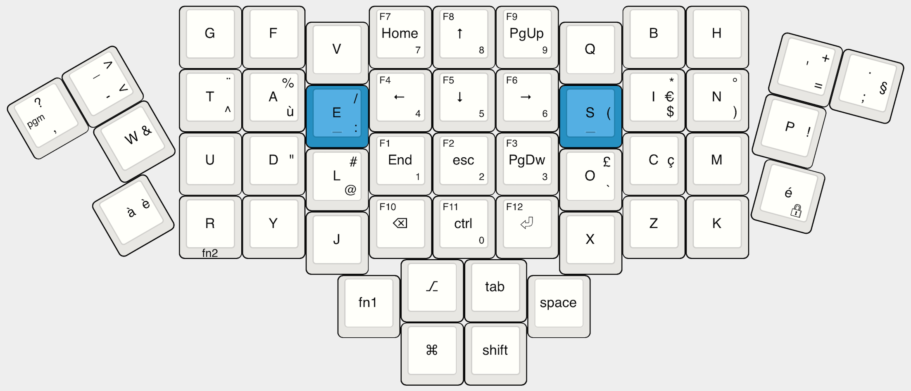
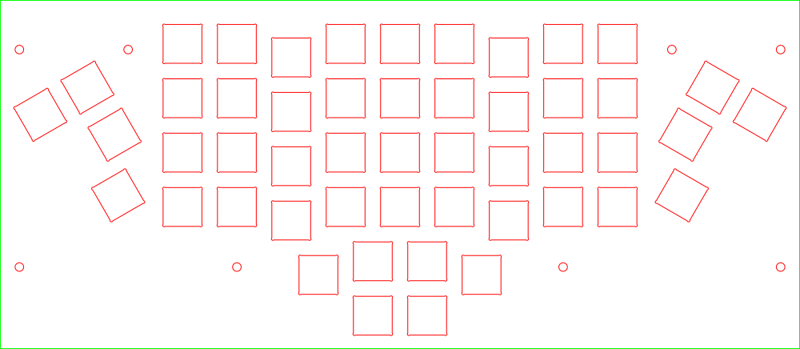

# SIK Keyboard

## An ergonomic, compact, mechanical keyboard

The SIK (named after a 80s' video game, look at it, you'll guess) is an ergonomic, compact, mechanical keyboard.

You can build it at any decent maker space, given some parts (switches, keycaps, diodes, microcontroler, cables, some plastics, and screws) and skills (soldering, running a laser cutter, screwing)

You can program it to your liking, given some (free) software ([the PJRC Teensy toolchain](https://www.pjrc.com/teensy/gcc.html)), and skills (some very basic C coding, or skilled search-and-replace for the simplest modifications)

## Pictures

An ergonomic keyboard, no larger than your regular laptop keyboard

Industrial look and feel, if you wish (may also be wooden made, with stitches, your call)

mac-fr layout with mixed french-englih-java key placement (or any other layout you build in it) and tap action keys (you tap, you get a letter, you hold, you get a function keys)

Hand made, with some coffee (was it tea?) and an apple (or whatever you take at breakfast)

## How to make it

It is mostly an hand-wired Atreus. They have a good guide [there](https://atreus.technomancy.us/assembly-hand-wired.pdf) But I will soon add a detailed guide, if you require it (add an issue about it, vote for it, I'll do it)

To find out what is your laser cutter kerf, you may use the [hardware/kerf_guess.svg](hardware/kerf_guess.svg) It will build a plate where the kerf is believed to be 0mm in the center, offset by 0.1mm every step as you go outwards, with added 0.05 for all to the right. Try your switches center left, then center right, then one more to the left, one more to the right, and on and on. Where it fits best, go to the drawing and find out the size of the cutting you need. I needed 13.6mm for my 14mm switches. Your mileage will vary.

Once that is known, the keyboard is just a sandwitch:

These two are linked together when soldering the switches. Dont forget the second one before soldering, you can't add it later.
- 1.5mm PMMA base plate: 
- 4mm PMMA supporting plate:  

Once that is built, follow Atreus guide for soldering. Specific pin instructions are hiden in [here](matrix.c). Read carefully while soldering (and before).

Then, to close the case:
- 5mm plywood spacer: 
- 4mm PMMA bottom: 

Finally, screw it: 9 M3 25mm screws will do the job. Use whatever orientation you find is the nicest.

## How to program it

Checkout this repository (don't forget, there are submodules, may the `git clone --recursive` be with you)

Plug it in the first available USB port at hand

And `./build.sh`

If it won't work, sorry, I'm really bad at knowing your setup. Try an issue, or maybe ask the guys at [TMK]((https://github.com/tmk/tmk_core)), they made the magic happen, they rock...

If you want another layout, think about it (twice?), then edit keymap_qwerty.c to match what you have in mind.

If you soldered it to different pins (have a look [there](matrix.c)), you can edit `matrix.c` to fix it by reading elsewhere on the controler.

If you added lines, columns, or whatever, or you want some funky features, again, go to [TMK](https://github.com/tmk/tmk_core). They make the magic happen.

## Licence

I have no idea which licence to use for now. Beware: My code is based on the [Atreus code](https://github.com/technomancy/tmk_keyboard/tree/atreus), which, if I got it right, is GPL. I'll probably have to go for GPL myself.

Still, you can use my additions to that code for whatever you want (or have a look at Atreus code, under their own terms) on your personnal keyboard. Use it at your own risks, which include and is not limited to:
- frying your microcontroler
- having the keyboard catch on fire
- have a non functionnal keyboard
- have a keyboard which does unexpected funky things like hard reboot your computer
- maybe frying your USB port, or whole computer if not well made
